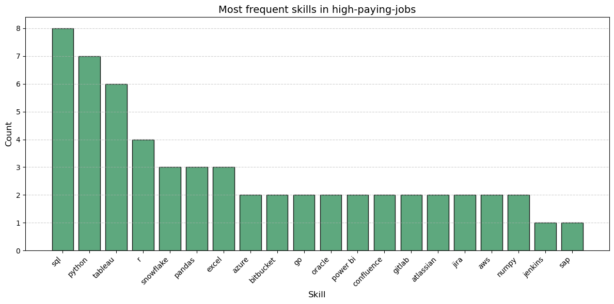
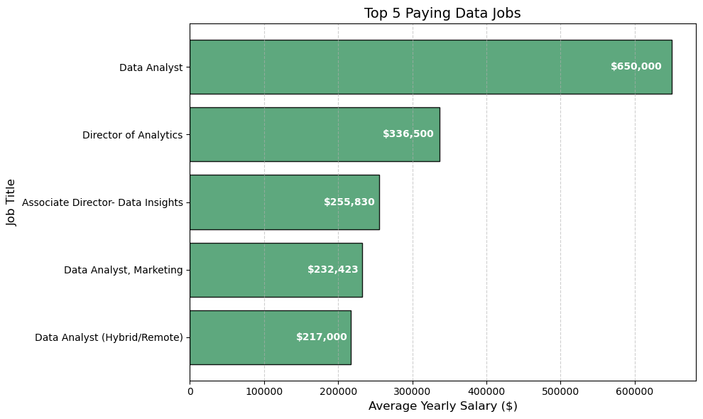
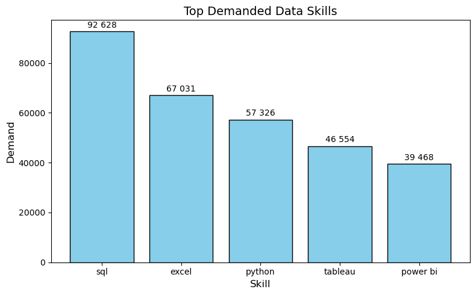
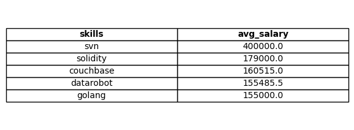
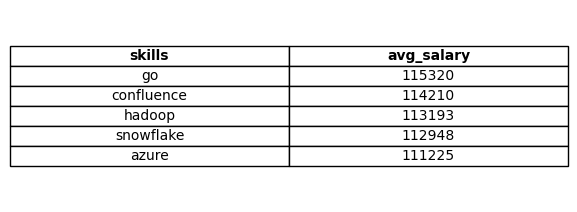

# Data Analyst Job Market — SQL Insights

This project explores the **Data Analyst** job market to identify:
- Top-paying roles  
- Skills those roles require  
- Skills most demanded by the market  
- Skills tied to higher salaries  
- The **optimal** skills to learn (where demand meets pay)

---

## Tools
SQL (PostgreSQL) · Visual Studio Code

---

## Query 1 — Top-Paying Data Analyst Jobs
**Query goal:** Select the highest-paying remote (“Anywhere”) Data Analyst roles.

```sql
SELECT
    job_id,
    job_title,
    salary_year_avg,
    name AS company_name
FROM job_postings_fact
LEFT JOIN company_dim ON job_postings_fact.company_id = company_dim.company_id
WHERE job_title_short = 'Data Analyst'
  AND job_location = 'Anywhere'
  AND salary_year_avg IS NOT NULL
ORDER BY salary_year_avg DESC
LIMIT 10;
```




---

## Query 2 — Skills Required for the Top-Paying Jobs
**Query goal:** Take the top 10 highest-paying jobs from Query 1 and list their required skills.

```sql
WITH top_paying_jobs AS (
    SELECT job_id, job_title, salary_year_avg, name AS company_name
    FROM job_postings_fact
    LEFT JOIN company_dim ON job_postings_fact.company_id = company_dim.company_id
    WHERE job_title_short = 'Data Analyst'
      AND job_location = 'Anywhere'
      AND salary_year_avg IS NOT NULL
    ORDER BY salary_year_avg DESC
    LIMIT 5
)
SELECT top_paying_jobs.*, skills
FROM top_paying_jobs
INNER JOIN skills_job_dim ON top_paying_jobs.job_id = skills_job_dim.job_id
INNER JOIN skills_dim ON skills_job_dim.skill_id = skills_dim.skill_id
ORDER BY salary_year_avg DESC;
```



**Takeaway:** Core analytics stack (SQL + Python + BI) is essential even at the top end.

---

## Query 3 — Most In-Demand Skills
**Query goal:** Rank skills by frequency across all Data Analyst postings.

```sql
SELECT 
    skills,
    COUNT(skills_job_dim.job_id) AS demand_count
FROM job_postings_fact
INNER JOIN skills_job_dim ON job_postings_fact.job_id = skills_job_dim.job_id
INNER JOIN skills_dim ON skills_job_dim.skill_id = skills_dim.skill_id
WHERE job_title_short = 'Data Analyst'
GROUP BY skills
ORDER BY demand_count DESC
LIMIT 5;
```



**Takeaway:** The foundational toolkit (SQL/Excel/Python/BI) remains the market baseline.

---

## Query 4 — Skills Associated with Higher Salaries
**Query goal:** Compute the average salary for each skill across roles with salary data.

```sql
SELECT 
    skills,
    AVG(salary_year_avg) AS avg_salary
FROM job_postings_fact
INNER JOIN skills_job_dim ON job_postings_fact.job_id = skills_job_dim.job_id
INNER JOIN skills_dim ON skills_job_dim.skill_id = skills_dim.skill_id
WHERE job_title_short = 'Data Analyst' AND salary_year_avg IS NOT NULL
GROUP BY skills
ORDER BY avg_salary DESC
LIMIT 5;
```

 


**Takeaway:** Certain engineering-oriented and niche tools bring notable salaries.

---

## Query 5 — Optimal Skills (High Demand × High Salary)
**Query goal:** On remote roles, identify skills that combine both demand and strong salaries.

```sql
SELECT
    skills_dim.skills,
    COUNT(skills_job_dim.job_id) AS demand_count,
    ROUND(AVG(job_postings_fact.salary_year_avg), 0) AS avg_salary
FROM job_postings_fact
INNER JOIN skills_job_dim ON job_postings_fact.job_id = skills_job_dim.job_id
INNER JOIN skills_dim ON skills_job_dim.skill_id = skills_dim.skill_id
WHERE job_title_short = 'Data Analyst'
  AND salary_year_avg IS NOT NULL
  AND job_work_from_home = True
GROUP BY skills_dim.skills
HAVING COUNT(skills_job_dim.job_id) > 10
ORDER BY avg_salary DESC, demand_count DESC
LIMIT 5;
```




**Takeaway:** Pair the core stack with **cloud/big-data platforms** to hit the sweet spot of **relevance + compensation**.

---

## Overall Conclusions
- **SQL is indispensable**: highest demand and present in top-paying roles.  
- **Python + BI (Tableau/Power BI)** form the must-have analyst toolkit.  
- **Cloud and Big Data** (Snowflake, Azure, AWS, BigQuery, Hadoop) deliver salary advantages.  
- Career roadmap: **master the core (SQL, Python, BI)** → add **1–2 premium platforms** to access top-tier opportunities.

---
